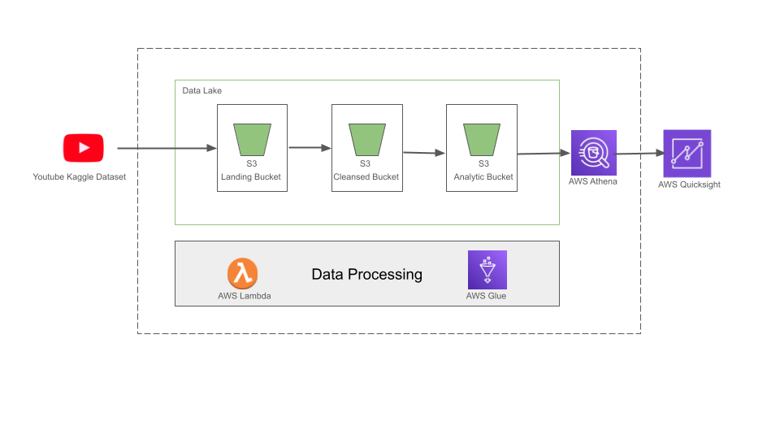
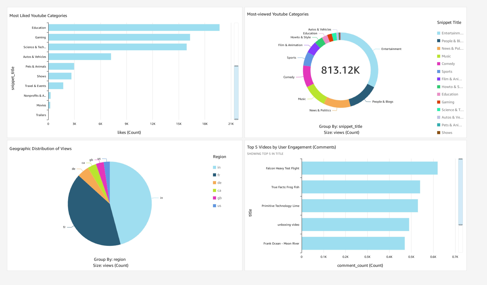

# 📊 YouTube Data Pipeline Project

A cloud-native, serverless data pipeline built on AWS to ingest, process, and visualize YouTube video metrics. This project demonstrates modern data engineering practices and showcases interactive dashboards for analytical insights.

---

## 🚀 Project Overview

This project implements an end-to-end ETL (Extract, Transform, Load) pipeline using **AWS serverless technologies**. It automates the process of:

- Collecting raw video data from the YouTube API
- Transforming and enriching the data
- Storing it efficiently in a structured data lake
- Querying it via Amazon Athena
- Visualizing trends using Amazon QuickSight

---

## 🏗️ Pipeline Architecture

The pipeline adopts a **three-tier S3 data lake** design and follows serverless-first principles to maximize scalability and minimize operational overhead.

### 🔧 Components

- **Data Ingestion:** YouTube video data via API stored in S3 (`landing` zone)
- **Data Processing:**
  - Lightweight transformations using AWS Lambda
  - Complex ETL jobs using AWS Glue
- **Data Lake Zones:** 
  - `landing` → `cleansed` → `analytics` layers in S3
- **Query Layer:** SQL-based queries with Amazon Athena
- **Visualization:** Dashboards created with Amazon QuickSight

*Serverless architecture for the YouTube data pipeline.*

---

## ⚙️ Technology Stack

| Category        | Tools Used                     |
|----------------|---------------------------------|
| **Storage**     | Amazon S3, Parquet format       |
| **Processing**  | AWS Lambda, AWS Glue            |
| **Analysis**    | Amazon Athena, SQL              |
| **Visualization** | Amazon QuickSight             |

---

## 📈 Data Visualization

The transformed data is visualized in an **interactive dashboard** hosted on Amazon QuickSight. It provides key insights into:

- Views, likes, comments per video/category
- Engagement trends over time
- Top performing content

*QuickSight dashboard showing YouTube analytics.*

---

## 📬 Contact

For questions, suggestions, or opportunities in data engineering, feel free to connect:

- 📧 [Email](mailto:gauthamkuckian07@gmail.com)
- 💼 [LinkedIn](https://linkedin.com/in/gauthamkuckian)
- 🖥️ [GitHub](https://github.com/gauthamkuckian)

---

© 2024 Gautham Kuckian | Data Engineering Portfolio
